<html>
<head>
  <meta charset="UTF-8">
  <meta name="viewport" content="width=device-width, initial-scale=1.0">
  <title> MMComposition </title>

  <link rel="icon" href="./static/images/mmcomposition.png">

  <link href="https://fonts.googleapis.com/css?family=Google+Sans|Noto+Sans|Castoro" rel="stylesheet">

  <link rel="stylesheet" href="./static/css/bulma.min.css">
  <link rel="stylesheet" href="./static/css/bulma-carousel.min.css">
  <link rel="stylesheet" href="./static/css/bulma-slider.min.css">
  <link rel="stylesheet" href="./static/css/fontawesome.all.min.css">
  <link rel="stylesheet" href="https://cdn.jsdelivr.net/gh/jpswalsh/academicons@1/css/academicons.min.css">
  <link rel="stylesheet" href="./static/css/index.css">
  <link rel="stylesheet" href="./static/css/leaderboard.css">
  <link rel="stylesheet" href="./static/css/video-player.css">

  <!-- <link href="https://unpkg.com/tabulator-tables@5.5.2/dist/css/tabulator_bulma.min.css" rel="stylesheet">
   -->
  

  
  
  
  
  
  

  
  <!-- 
  

   -->
  

</head>
<body>

<nav class="navbar" role="navigation" aria-label="main navigation">
  

    <a role="button" class="navbar-burger" aria-label="menu" aria-expanded="false">
      
      
      
    </a>
  

  

    

  

        
🔥

        <a class="navbar-link">
          More Research
        </a>
        

          <a class="navbar-item" href="https://github.com/yunlong10/MMComposition">
            <b>MMComposition</b> 
          </a>
          <a class="navbar-item" href="https://github.com/yunlong10/Awesome-LLMs-for-Video-Understanding">
            <b>Vid-LLM Survey</b> 
          </a>
        

      

    

  

</nav>

<section class="hero">
  

    

      

        

          <h1 class="title is-1 publication-title is-bold">
            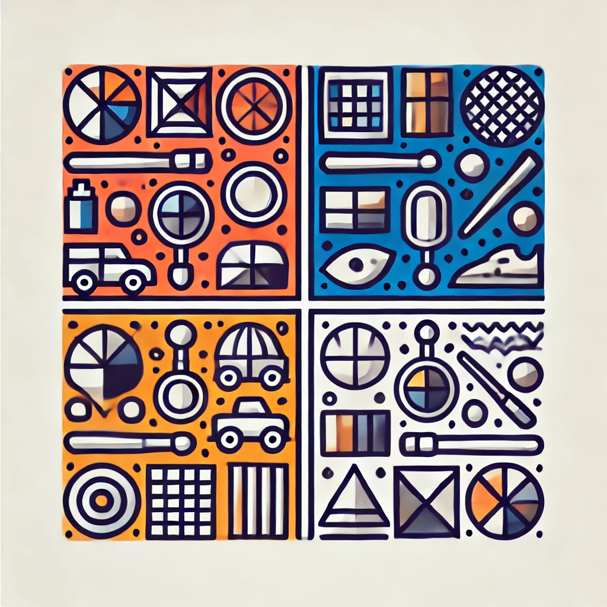
            MMComposition
            </h1>
          <h2 class="subtitle is-3 publication-subtitle" style="margin-bottom: 20px;">
            Revisiting the Compositionality of Pre-trained Vision-Language Models
          </h2>
          

            <a href="https://hanghuacs.owlstown.net/">Hang Hua</a>*1,
            <a href="https://yunlong10.github.io">Yunlong Tang</a>*1,
            <a href="https://openreview.net/profile?id=~Ziyun_Zeng2">Ziyun Zeng</a>*1,
            <a href="http://llcao.net/">Liangliang Cao</a>2,
            <a href="https://zyang-ur.github.io/">Zhengyuan Yang</a>3, 
            <a href="https://hornhehhf.github.io/">Hangfeng He</a>1,
            <a href="https://www.cs.rochester.edu/~cxu22/index.html">Chenliang Xu</a>1,
            <a href="https://www.cs.rochester.edu/u/jluo/">Jiebo Luo</a>&dagger;1 
            <!-- <a href="https://github.com/BradyFU/Video-MME">MMComposition Team</a> -->
        

          

            1University of Rochester,
            2Google,
            3Microsoft
            <!-- <b style="color:#f41c1c">ICLR 2024 Oral</b> (85 in 7304, 1.2%) -->
          

          

            

              <!-- PDF Link. -->
              
                <a href=""
                   class="external-link button is-normal is-rounded is-dark">
                <!-- <a href="https://lupantech.github.io/papers/arxiv23_mathvista.pdf"
                   class="external-link button is-normal is-rounded is-dark"> -->
                  
                      <i class="ai ai-arxiv"></i>
                  
                  arXiv
                </a>
              
              <!-- Code Link. -->
              
                <a href="https://github.com/yunlong10/MMComposition"
                   class="external-link button is-normal is-rounded is-dark">
                  
                      <i class="fab fa-github"></i>
                  
                  Code
                  </a>
              
              <!-- Dataset Link. -->
              
                <a href="https://github.com/yunlong10/MMComposition"
                   class="external-link button is-normal is-rounded is-dark">
                  
                      <!-- <i class="far fa-images"></i> -->
                      
📊

                  
                  Dataset
                </a>
               
              <!-- Leaderboard Link. -->
              
                <a href="#leaderboard"
                   class="external-link button is-normal is-rounded is-dark">
                  
                      
🏆

                  
                  Leaderboard
                </a>
              
              
                <a href="#citation"
                   class="external-link button is-normal is-rounded is-dark">
                  
                      
📃

                  
                  Cite
                </a>
              

            

          

        

      

    

    

  

</section>

<section class="section">
  

    <!-- Abstract. -->
    

      

        <h2 class="title is-3">Introduction</h2>
        

The development of large Vision-Language Models (VLMs) has greatly improved multimodal tasks like image captioning, visual question answering, and cross-modal retrieval by better integrating visual and textual information. However, while VLMs show strong performance, researchers still lack a full understanding of their compositionality — the ability to grasp and generate new combinations of known visual and textual elements. Current benchmarks assess compositionality mainly through objects, relations, and attributes, but overlook deeper aspects like object interactions, counting, and complex compositions.
To address these limitations, we introduce <strong>MMComposition</strong>, a novel benchmark specifically designed to comprehensively evaluate the compositionality of vision-language models (VLMs). <strong>MMComposition</strong> assesses VLMs across three main dimensions: vision-language (VL) compositional perception, reasoning, and probing. Unlike previous benchmarks that primarily focus on text-to-image retrieval or single-choice questions, <strong>MMComposition</strong> offers a diverse set of 4,342 tasks, including single-image and multi-image scenarios, single-choice and indefinite-choice questions. This ensures a thorough evaluation of models' ability to handle complex compositional tasks across modalities.

Our findings reveal that even state-of-the-art models like GPT-4o struggle with fine-grained compositional reasoning, highlighting the need for further advancements in VLMs' compositional capabilities.

Our key contributions are:

<ol> <li>Introducing <strong>MMComposition</strong>, a novel, high-quality benchmark for evaluating the compositionality of pre-trained VLMs across perception, reasoning, and probing.</li> <li>Providing a comprehensive experimental evaluation of 54 state-of-the-art VLMs, demonstrating the challenging nature of <strong>MMComposition</strong> and exposing significant gaps between model and human performance.</li> <li>Analyzing the critical factors in VLM architecture that influence compositionality, offering insights for future improvements in model design and training.</li> </ol>

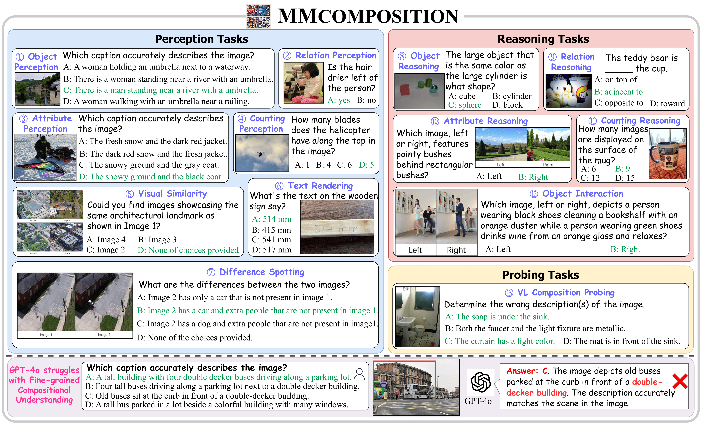

<!--/ Abstract. -->

</section>

<section class="section">
  

    

      

        <h2 class="title is-3" id="leaderboard">🏆 Leaderboard</h2>
        

          <!-- 
Accuracy scores on Video-MME are presented for short, medium, and long videos, taking the corresponding subtitles as input or not.
          

          

            

              <strong>Short Video:</strong> &lt; 2min  
              <strong>Medium Video:</strong> 4min ~ 15min
              <strong>Long Video:</strong> 30min ~ 60min
            
 -->
            

              By default, this leaderboard is sorted by overall results. To view other sorted results, please click on the corresponding cell. Colored rows indicate closed-source models/APIs.
            

          <!-- 
 -->
          <table class="js-sort-table js-sort-asc" id="results" style="margin-left: auto; margin-right: auto;">
              <thead>
                  <tr>
                      <th rowspan="1" style="vertical-align: middle; width: 50px;" data-js-sort-colNum="4"><strong>#</strong></th>
                      <th rowspan="1" class="no-sort" style="vertical-align: middle; width: 180px;" data-js-sort-colNum="NaN"><strong>Model</strong></th>
                      <th rowspan="1" class="no-sort" style="vertical-align: middle; width: 30px;" data-js-sort-colNum="NaN"><strong>LLM  Params</strong></th>
                      <th colspan="1" style="vertical-align: middle; width: 110px;" data-js-sort-colNum="3"><strong>Date</strong></th>
                      <th colspan="1" style="vertical-align: middle; width: 120px;" data-js-sort-colNum="4"><strong>Overall (%)</strong></th>
                      <th colspan="1" style="vertical-align: middle; width: 120px;" data-js-sort-colNum="5"><strong>Perception (%)</strong></th>
                      <th colspan="1" style="vertical-align: middle; width: 120px;" data-js-sort-colNum="6"><strong>Reasoning (%)</strong></th>
                      <th colspan="1" style="vertical-align: middle; width: 120px;" data-js-sort-colNum="7"><strong>Probing (%)</strong></th>
                  </tr>
              </thead>
              <tbody>
                  <tr>
                      <td style="vertical-align: middle;">1</td>
                      <td style="text-align: left; padding: 2px 10px;">
                          <b class="">
                              <a href="https://huggingface.co/OpenGVLab/InternVL2-40B" class="ext-link" style="font-size: 16px; margin-left: 5px;">InternVL2-40B</a>
                              
Shanghai AI Lab

                          </b>
                      </td>
                      <td style="vertical-align: middle;">40B</td>
                      <td style="vertical-align: middle;">2024/10/01</td>
                      <td style="vertical-align: middle;">67.95</td>
                      <td style="vertical-align: middle;">65.44</td>
                      <td style="vertical-align: middle;">73.99</td>
                      <td style="vertical-align: middle;">59.59</td>
                  </tr>
                  <tr>
                      <td style="vertical-align: middle;">2</td>
                      <td style="text-align: left; padding: 2px 10px;"><b class=""><a href="https://huggingface.co/OpenGVLab/InternVL2-Llama3-76B" class="ext-link" style="font-size: 16px; margin-left: 5px;">InternVL2-76B
                          
Shanghai AI Lab

                      </a></b></td>
                      <td style="vertical-align: middle;">76B</td>
                      <td style="vertical-align: middle;">2024/10/01</td>
                      <td style="vertical-align: middle;">67.28</td>
                      <td style="vertical-align: middle;">63.41</td>
                      <td style="vertical-align: middle;">75.44</td>
                      <td style="vertical-align: middle;">58.46</td>
                  </tr>
                  <tr>
                      <td style="vertical-align: middle;">3</td>
                      <td style="text-align: left; padding: 2px 10px;"><b class=""><a href="" class="ext-link" style="font-size: 16px; margin-left: 5px;">Qwen2-VL-72B
                          
Alibaba

                      </a></b></td>
                      <td style="vertical-align: middle;">72B</td>
                      <td style="vertical-align: middle;">2024/10/01</td>
                      <td style="vertical-align: middle;">65.24</td>
                      <td style="vertical-align: middle;">56.53</td>
                      <td style="vertical-align: middle;">76.39</td>
                      <td style="vertical-align: middle;">70.26</td>
                  </tr>
                  <tr>
                      <td style="vertical-align: middle;">4</td>
                      <td style="text-align: left; padding: 2px 10px;">
                          <b class="">
                              <a href="https://huggingface.co/OpenGVLab/InternVL-Chat-V1-2-Plus" class="ext-link" style="font-size: 16px; margin-left: 5px;">InternVL-Chat-V1.2-Plus</a>
                              
Shanghai AI Lab

                          </b>
                      </td>
                      <td style="vertical-align: middle;">40B</td>
                      <td style="vertical-align: middle;">2024/10/01</td>
                      <td style="vertical-align: middle;">64.94</td>
                      <td style="vertical-align: middle;">60.73</td>
                      <td style="vertical-align: middle;">70.78</td>
                      <td style="vertical-align: middle;">65.80</td>
                  </tr>
                  <tr>
                      <td style="vertical-align: middle;">5</td>
                      <td style="text-align: left; padding: 2px 10px;">
                          <b class="">
                              <a href="https://huggingface.co/OpenGVLab/InternVL2-26B" class="ext-link" style="font-size: 16px; margin-left: 5px;">InternVL2-26B</a>
                              
Shanghai AI Lab

                          </b>
                      </td>
                      <td style="vertical-align: middle;">26B</td>
                      <td style="vertical-align: middle;">2024/10/01</td>
                      <td style="vertical-align: middle;">63.08</td>
                      <td style="vertical-align: middle;">60.40</td>
                      <td style="vertical-align: middle;">70.03</td>
                      <td style="vertical-align: middle;">52.43</td>
                  </tr>
                  <tr>
                      <td style="vertical-align: middle;">6</td>
                      <td style="text-align: left; padding: 2px 10px;">
                          <b class="">
                              <a href="https://huggingface.co/Efficient-Large-Model/VILA1.5-40b" class="ext-link" style="font-size: 16px; margin-left: 5px;">VILA1.5-40B</a>
                              
NVIDIA & MIT

                          </b>
                      </td>
                      <td style="vertical-align: middle;">40B</td>
                      <td style="vertical-align: middle;">2024/10/01</td>
                      <td style="vertical-align: middle;">63.08</td>
                      <td style="vertical-align: middle;">60.40</td>
                      <td style="vertical-align: middle;">70.03</td>
                      <td style="vertical-align: middle;">52.43</td>
                  </tr>
                  <tr style="background-color: #f0e4f1;">
                      <td style="vertical-align: middle;">7</td>
                      <td style="text-align: left; padding: 2px 10px;"><b class=""><a href="https://openai.com/index/hello-gpt-4o/" class="ext-link" style="font-size: 16px; margin-left: 5px;">GPT-4o
                          
OpenAI

                      </a> </b></td>
                      <td style="vertical-align: middle;">-</td>
                      <td style="vertical-align: middle;">2024/10/01</td>
                      <td style="vertical-align: middle;">59.71</td>
                      <td style="vertical-align: middle;">57.63</td>
                      <td style="vertical-align: middle;">64.17</td>
                      <td style="vertical-align: middle;">54.65</td>
                  </tr>
                  <tr>
                      <td style="vertical-align: middle;">8</td>
                      <td style="text-align: left; padding: 2px 10px;"><b class=""><a href="https://huggingface.co/OpenGVLab/InternVL-Chat-V1-2" class="ext-link" style="font-size: 16px; margin-left: 5px;">InternVL-Chat-v1.2
                          
Shanghai AI Lab

                      </a> </b></td>
                      <td style="vertical-align: middle;">40B</td>
                      <td style="vertical-align: middle;">2024/10/01</td>
                      <td style="vertical-align: middle;">59.61</td>
                      <td style="vertical-align: middle;">56.49</td>
                      <td style="vertical-align: middle;">63.79</td>
                      <td style="vertical-align: middle;">60.71</td>
                  </tr>
                  <tr>
                      <td style="vertical-align: middle;">9</td>
                      <td style="text-align: left; padding: 2px 10px;"><b class=""><a href="https://huggingface.co/OpenGVLab/InternVL-Chat-V1-5" class="ext-link" style="font-size: 16px; margin-left: 5px;">InternVL-Chat-v1.5
                          
Shanghai AI Lab

                      </a> </b></td>
                      <td style="vertical-align: middle;">26B</td>
                      <td style="vertical-align: middle;">2024/10/01</td>
                      <td style="vertical-align: middle;">59.40</td>
                      <td style="vertical-align: middle;">53.68</td>
                      <td style="vertical-align: middle;">68.20</td>
                      <td style="vertical-align: middle;">57.01</td>
                  </tr>
                  <tr>
                      <td style="vertical-align: middle;">10</td>
                      <td style="text-align: left; padding: 2px 10px;"><b class=""><a href="https://huggingface.co/OpenGVLab/InternVL2-8B" class="ext-link" style="font-size: 16px; margin-left: 5px;">InternVL2-8B
                          
Shanghai AI Lab

                      </a> </b></td>
                      <td style="vertical-align: middle;">8B</td>
                      <td style="vertical-align: middle;">2024/10/01</td>
                      <td style="vertical-align: middle;">58.47</td>
                      <td style="vertical-align: middle;">53.44</td>
                      <td style="vertical-align: middle;">67.00</td>
                      <td style="vertical-align: middle;">54.10</td>
                  </tr>
                  <tr>
                      <td style="vertical-align: middle;">11</td>
                      <td style="text-align: left; padding: 2px 10px;"><b class=""><a href="https://huggingface.co/liuhaotian/llava-v1.6-34b" class="ext-link" style="font-size: 16px; margin-left: 5px;">LLaVA-1.6-34B
                          
NTU & UW Madison & ByteDance

                      </a></b></td>
                      <td style="vertical-align: middle;">34B</td>
                      <td style="vertical-align: middle;">2024/10/01</td>
                      <td style="vertical-align: middle;">58.25</td>
                      <td style="vertical-align: middle;">57.82</td>
                      <td style="vertical-align: middle;">58.88</td>
                      <td style="vertical-align: middle;">58.17</td>
                  </tr>
                  <tr>
                      <td style="vertical-align: middle;">12</td>
                      <td style="text-align: left; padding: 2px 10px;"><b class=""><a href="https://huggingface.co/openbmb/MiniCPM-V-2_6" class="ext-link" style="font-size: 16px; margin-left: 5px;">MiniCPM-V2.6
                          
Tsinghua University

                      </a></b></td>
                      <td style="vertical-align: middle;">8B</td>
                      <td style="vertical-align: middle;">2024/10/01</td>
                      <td style="vertical-align: middle;">57.01</td>
                      <td style="vertical-align: middle;">55.36</td>
                      <td style="vertical-align: middle;">60.14</td>
                      <td style="vertical-align: middle;">54.43</td>
                  </tr>
                  <tr>
                      <td style="vertical-align: middle;">13</td>
                      <td style="text-align: left; padding: 2px 10px;"><b class=""><a href="https://huggingface.co/internlm/internlm-xcomposer2-4khd-7b" class="ext-link" style="font-size: 16px; margin-left: 5px;">InternLM-XComposer2-4KHD-7B
                          
Shanghai AI Lab & CUHK & SenseTime

                      </a> </b></td>
                      <td style="vertical-align: middle;">7B</td>
                      <td style="vertical-align: middle;">2024/10/01</td>
                      <td style="vertical-align: middle;">56.69</td>
                      <td style="vertical-align: middle;">52.55</td>
                      <td style="vertical-align: middle;">61.71</td>
                      <td style="vertical-align: middle;">60.02</td>
                  </tr>
                  <tr style="background-color: #f0e4f1;">
                      <td style="vertical-align: middle;">14</td>
                      <td style="text-align: left; padding: 2px 10px;"><b class=""><a href="https://github.com/QwenLM/Qwen-VL#qwen-vl-plus" class="ext-link" style="font-size: 16px; margin-left: 5px;">Qwen-VL-Max
                          
Alibaba

                      </a></b></td>
                      <td style="vertical-align: middle;">-</td>
                      <td style="vertical-align: middle;">2024/10/01</td>
                      <td style="vertical-align: middle;">55.18</td>
                      <td style="vertical-align: middle;">50.36</td>
                      <td style="vertical-align: middle;">59.63</td>
                      <td style="vertical-align: middle;">63.87</td>
                  </tr>
                  <tr>
                      <td style="vertical-align: middle;">15</td>
                      <td style="text-align: left; padding: 2px 10px;"><b class=""><a href="https://huggingface.co/internlm/internlm-xcomposer2d5-7b" class="ext-link" style="font-size: 16px; margin-left: 5px;">InternLM-XComposer2.5-7B
                      
Shanghai AI Lab & CUHK & SenseTime

                      </a></b></td>
                      <td style="vertical-align: middle;">7B</td>
                      <td style="vertical-align: middle;">2024/10/01</td>
                      <td style="vertical-align: middle;">55.10</td>
                      <td style="vertical-align: middle;">50.61</td>
                      <td style="vertical-align: middle;">63.16</td>
                      <td style="vertical-align: middle;">49.64</td>
                  </tr>
                  <tr style="background-color: #f0e4f1;">
                      <td style="vertical-align: middle;">16</td>
                      <td style="text-align: left; padding: 2px 10px;"><b class=""><a href="https://cloud.tencent.com/document/product/1729/105701" class="ext-link" style="font-size: 16px; margin-left: 5px;">Hunyuan-Vision
                          
Tencent

                      </a></b></td>
                      <td style="vertical-align: middle;">-</td>
                      <td style="vertical-align: middle;">2024/10/01</td>
                      <td style="vertical-align: middle;">54.64</td>
                      <td style="vertical-align: middle;">54.80</td>
                      <td style="vertical-align: middle;">57.18</td>
                      <td style="vertical-align: middle;">45.03</td>
                  </tr>
                  <tr>
                      <td style="vertical-align: middle;">17</td>
                      <td style="text-align: left; padding: 2px 10px;"><b class=""><a href="https://huggingface.co/internlm/internlm-xcomposer2-vl-7b" class="ext-link" style="font-size: 16px; margin-left: 5px;">InternLM-Xcomposer2-VL
                      
Shanghai AI Lab & CUHK & SenseTime

                      </a></b></td>
                      <td style="vertical-align: middle;">7B</td>
                      <td style="vertical-align: middle;">2024/10/01</td>
                      <td style="vertical-align: middle;">54.62</td>
                      <td style="vertical-align: middle;">51.25</td>
                      <td style="vertical-align: middle;">58.75</td>
                      <td style="vertical-align: middle;">57.15</td>
                  </tr>
                  <tr style="background-color: #f0e4f1;">
                      <td style="vertical-align: middle;">18</td>
                      <td style="text-align: left; padding: 2px 10px;"><b class=""><a href="https://aistudio.google.com/app/prompts/new_chat" class="ext-link" style="font-size: 16px; margin-left: 5px;">Gemini-1.5-Pro
                          
Google

                      </a></b></td>
                      <td style="vertical-align: middle;">-</td>
                      <td style="vertical-align: middle;">2024/10/01</td>
                      <td style="vertical-align: middle;">53.27</td>
                      <td style="vertical-align: middle;">50.64</td>
                      <td style="vertical-align: middle;">58.12</td>
                      <td style="vertical-align: middle;">49.60</td>
                  </tr>
                  <tr>
                      <td style="vertical-align: middle;">19</td>
                      <td style="text-align: left; padding: 2px 10px;"><b class=""><a href="https://huggingface.co/YanweiLi/MGM-34B" class="ext-link" style="font-size: 16px; margin-left: 5px;">Mini-Gemini-34B
                          
CUHK & SmartMore

                      </a></b></td>
                      <td style="vertical-align: middle;">34B</td>
                      <td style="vertical-align: middle;">2024/10/01</td>
                      <td style="vertical-align: middle;">53.06</td>
                      <td style="vertical-align: middle;">51.25</td>
                      <td style="vertical-align: middle;">58.94</td>
                      <td style="vertical-align: middle;">41.79</td>
                  </tr>
                  <tr>
                      <td style="vertical-align: middle;">20</td>
                      <td style="text-align: left; padding: 2px 10px;"><b class=""><a href="https://huggingface.co/OpenGVLab/InternVL2-4B" class="ext-link" style="font-size: 16px; margin-left: 5px;">InternVL2-4B
                          
Shanghai AI Lab

                      </a> </b></td>
                      <td style="vertical-align: middle;">4B</td>
                      <td style="vertical-align: middle;">2024/10/01</td>
                      <td style="vertical-align: middle;">52.03</td>
                      <td style="vertical-align: middle;">46.94</td>
                      <td style="vertical-align: middle;">62.53</td>
                      <td style="vertical-align: middle;">41.18</td>
                  </tr>
                  <tr>
                      <td style="vertical-align: middle;">21</td>
                      <td style="text-align: left; padding: 2px 10px;"><b class=""><a href="https://huggingface.co/meta-llama/Llama-3.2-11B-Vision-Instruct" class="ext-link" style="font-size: 16px; margin-left: 5px;">LLaMA-3.2-11B-Vision-Instruct
                          
Meta

                      </a> </b></td>
                      <td style="vertical-align: middle;">11B</td>
                      <td style="vertical-align: middle;">2024/10/01</td>
                      <td style="vertical-align: middle;">52.01</td>
                      <td style="vertical-align: middle;">50.88</td>
                      <td style="vertical-align: middle;">54.47</td>
                      <td style="vertical-align: middle;">49.17</td>
                  </tr>
                  <tr>
                      <td style="vertical-align: middle;">22</td>
                      <td style="text-align: left; padding: 2px 10px;"><b class=""><a href="https://huggingface.co/openbmb/MiniCPM-Llama3-V-2_5" class="ext-link" style="font-size: 16px; margin-left: 5px;">MiniCPM-Llama3-V2.5
                          
Tsinghua University

                      </a></b></td>
                      <td style="vertical-align: middle;">8B</td>
                      <td style="vertical-align: middle;">2024/10/01</td>
                      <td style="vertical-align: middle;">51.54</td>
                      <td style="vertical-align: middle;">45.68</td>
                      <td style="vertical-align: middle;">62.85</td>
                      <td style="vertical-align: middle;">41.79</td>
                  </tr>
                  <tr>
                      <td style="vertical-align: middle;">23</td>
                      <td style="text-align: left; padding: 2px 10px;"><b class=""><a href="https://huggingface.co/YanweiLi/MGM-34B-HD" class="ext-link" style="font-size: 16px; margin-left: 5px;">Mini-Gemini-34B-HD
                          
CUHK & SmartMore

                      </a></b></td>
                      <td style="vertical-align: middle;">34B</td>
                      <td style="vertical-align: middle;">2024/10/01</td>
                      <td style="vertical-align: middle;">51.48</td>
                      <td style="vertical-align: middle;">47.73</td>
                      <td style="vertical-align: middle;">61.40</td>
                      <td style="vertical-align: middle;">35.91</td>
                  </tr>
                  <tr>
                      <td style="vertical-align: middle;">24</td>
                      <td style="text-align: left; padding: 2px 10px;"><b class=""><a href="https://huggingface.co/BAAI/Bunny-Llama-3-8B-V" class="ext-link" style="font-size: 16px; margin-left: 5px;">Bunny-LLaMA-3-V
                          
BAAI

                      </a></b></td>
                      <td style="vertical-align: middle;">8B</td>
                      <td style="vertical-align: middle;">2024/10/01</td>
                      <td style="vertical-align: middle;">50.81</td>
                      <td style="vertical-align: middle;">47.81</td>
                      <td style="vertical-align: middle;">52.64</td>
                      <td style="vertical-align: middle;">59.44</td>
                  </tr>
                  <tr>
                      <td style="vertical-align: middle;">25</td>
                      <td style="text-align: left; padding: 2px 10px;"><b class=""><a href="https://huggingface.co/mx262/MiniMonkey" class="ext-link" style="font-size: 16px; margin-left: 5px;">Mini-Monkey
                          
HUST

                      </a></b></td>
                      <td style="vertical-align: middle;">2B</td>
                      <td style="vertical-align: middle;">2024/10/01</td>
                      <td style="vertical-align: middle;">50.41</td>
                      <td style="vertical-align: middle;">47.81</td>
                      <td style="vertical-align: middle;">56.49</td>
                      <td style="vertical-align: middle;">42.37</td>
                  </tr>
                  <tr>
                      <td style="vertical-align: middle;">26</td>
                      <td style="text-align: left; padding: 2px 10px;"><b class=""><a href="https://huggingface.co/microsoft/Phi-3.5-vision-instruct" class="ext-link" style="font-size: 16px; margin-left: 5px;">Phi3.5-Vision-Instruct
                          
Microsoft

                      </a></b></td>
                      <td style="vertical-align: middle;">4.2B</td>
                      <td style="vertical-align: middle;">2024/10/01</td>
                      <td style="vertical-align: middle;">50.02</td>
                      <td style="vertical-align: middle;">45.97</td>
                      <td style="vertical-align: middle;">54.53</td>
                      <td style="vertical-align: middle;">54.65</td>
                  </tr>
                  <tr>
                      <td style="vertical-align: middle;">27</td>
                      <td style="text-align: left; padding: 2px 10px;"><b class=""><a href="https://huggingface.co/THUDM/cogvlm2-llama3-chat-19B" class="ext-link" style="font-size: 16px; margin-left: 5px;">ColgVLM2-Llama3-Chat-19B
                          
Zhipu AI

                      </a></b></td>
                      <td style="vertical-align: middle;">19B</td>
                      <td style="vertical-align: middle;">2024/10/01</td>
                      <td style="vertical-align: middle;">49.84</td>
                      <td style="vertical-align: middle;">50.34</td>
                      <td style="vertical-align: middle;">48.87</td>
                      <td style="vertical-align: middle;">50.69</td>
                  </tr>
                  <tr>
                      <td style="vertical-align: middle;">28</td>
                      <td style="text-align: left; padding: 2px 10px;"><b class=""><a href="https://huggingface.co/microsoft/Phi-3-vision-128k-instruct" class="ext-link" style="font-size: 16px; margin-left: 5px;">Phi3-Vision-Instruct
                          
Microsoft

                      </a></b></td>
                      <td style="vertical-align: middle;">4.2B</td>
                      <td style="vertical-align: middle;">2024/10/01</td>
                      <td style="vertical-align: middle;">48.52</td>
                      <td style="vertical-align: middle;">45.55</td>
                      <td style="vertical-align: middle;">50.44</td>
                      <td style="vertical-align: middle;">56.75</td>
                  </tr>
                  <tr>
                      <td style="vertical-align: middle;">29</td>
                      <td style="text-align: left; padding: 2px 10px;"><b class=""><a href="https://huggingface.co/01-ai/Yi-VL-34B" class="ext-link" style="font-size: 16px; margin-left: 5px;">Yi-VL-34B
                          
01.AI

                      </a></b></td>
                      <td style="vertical-align: middle;">34B</td>
                      <td style="vertical-align: middle;">2024/10/01</td>
                      <td style="vertical-align: middle;">47.86</td>
                      <td style="vertical-align: middle;">42.99</td>
                      <td style="vertical-align: middle;">53.15</td>
                      <td style="vertical-align: middle;">53.88</td>
                  </tr>
                  <tr style="background-color: #f0e4f1;">
                      <td style="vertical-align: middle;">30</td>
                      <td style="text-align: left; padding: 2px 10px;"><b class=""><a href="https://www.stepfun.com/#step1v" class="ext-link" style="font-size: 16px; margin-left: 5px;">Step-1V-32K
                          
Stepfun

                      </a></b></td>
                      <td style="vertical-align: middle;">-</td>
                      <td style="vertical-align: middle;">2024/10/01</td>
                      <td style="vertical-align: middle;">47.64</td>
                      <td style="vertical-align: middle;">41.25</td>
                      <td style="vertical-align: middle;">57.49</td>
                      <td style="vertical-align: middle;">45.46</td>
                  </tr>
                  <tr>
                      <td style="vertical-align: middle;">31</td>
                      <td style="text-align: left; padding: 2px 10px;"><b class=""><a href="https://huggingface.co/ConvLLaVA/ConvLLaVA-sft-1024" class="ext-link" style="font-size: 16px; margin-left: 5px;">ConvLLaVA-1024-7B
                          
Alibaba & Tsinghua University

                      </a></b></td>
                      <td style="vertical-align: middle;">7B</td>
                      <td style="vertical-align: middle;">2024/10/01</td>
                      <td style="vertical-align: middle;">47.32</td>
                      <td style="vertical-align: middle;">43.70</td>
                      <td style="vertical-align: middle;">54.41</td>
                      <td style="vertical-align: middle;">40.89</td>
                  </tr>
                  <tr>
                      <td style="vertical-align: middle;">32</td>
                      <td style="text-align: left; padding: 2px 10px;"><b class=""><a href="https://huggingface.co/01-ai/Yi-VL-6B" class="ext-link" style="font-size: 16px; margin-left: 5px;">Yi-VL-6B
                          
01.AI

                      </a></b></td>
                      <td style="vertical-align: middle;">6B</td>
                      <td style="vertical-align: middle;">2024/10/01</td>
                      <td style="vertical-align: middle;">46.87</td>
                      <td style="vertical-align: middle;">43.80</td>
                      <td style="vertical-align: middle;">50.76</td>
                      <td style="vertical-align: middle;">48.76</td>
                  </tr>
                  <tr>
                      <td style="vertical-align: middle;">33</td>
                      <td style="text-align: left; padding: 2px 10px;"><b class=""><a href="https://huggingface.co/BAAI/Bunny-v1_0-3B" class="ext-link" style="font-size: 16px; margin-left: 5px;">Bunny-3B
                          
BAAI

                      </a></b></td>
                      <td style="vertical-align: middle;">3B</td>
                      <td style="vertical-align: middle;">2024/10/01</td>
                      <td style="vertical-align: middle;">46.32</td>
                      <td style="vertical-align: middle;">43.42</td>
                      <td style="vertical-align: middle;">47.98</td>
                      <td style="vertical-align: middle;">55.08</td>
                  </tr>
                  <tr>
                      <td style="vertical-align: middle;">34</td>
                      <td style="text-align: left; padding: 2px 10px;"><b class=""><a href="https://huggingface.co/BAAI/Bunny-v1_0-4B" class="ext-link" style="font-size: 16px; margin-left: 5px;">Bunny-4B-V1.0
                          
BAAI

                      </a></b></td>
                      <td style="vertical-align: middle;">3B</td>
                      <td style="vertical-align: middle;">2024/10/01</td>
                      <td style="vertical-align: middle;">46.07</td>
                      <td style="vertical-align: middle;">43.68</td>
                      <td style="vertical-align: middle;">50.50</td>
                      <td style="vertical-align: middle;">42.66</td>
                  </tr>
                  <tr>
                      <td style="vertical-align: middle;">35</td>
                      <td style="text-align: left; padding: 2px 10px;"><b class=""><a href="https://huggingface.co/favor123/llava-hr-13b-x-sft-1024" class="ext-link" style="font-size: 16px; margin-left: 5px;">LLaVA-HR-13B
                      
Xiamen University

                      </a></b></td>
                      <td style="vertical-align: middle;">13B</td>
                      <td style="vertical-align: middle;">2024/10/01</td>
                      <td style="vertical-align: middle;">46.02</td>
                      <td style="vertical-align: middle;">41.83</td>
                      <td style="vertical-align: middle;">51.26</td>
                      <td style="vertical-align: middle;">48.80</td>
                  </tr>
                  <tr>
                      <td style="vertical-align: middle;">36</td>
                      <td style="text-align: left; padding: 2px 10px;"><b class=""><a href="https://huggingface.co/ConvLLaVA/ConvLLaVA-sft-1536" class="ext-link" style="font-size: 16px; margin-left: 5px;">ConvLLaVA-1536-7B
                          
Alibaba & Tsinghua University

                      </a></b></td>
                      <td style="vertical-align: middle;">7B</td>
                      <td style="vertical-align: middle;">2024/10/01</td>
                      <td style="vertical-align: middle;">45.52</td>
                      <td style="vertical-align: middle;">41.84</td>
                      <td style="vertical-align: middle;">54.09</td>
                      <td style="vertical-align: middle;">34.20</td>
                  </tr>
                  <tr>
                      <td style="vertical-align: middle;">37</td>
                      <td style="text-align: left; padding: 2px 10px;"><b class=""><a href="https://huggingface.co/OpenGVLab/InternVL2-2B" class="ext-link" style="font-size: 16px; margin-left: 5px;">InternVL2-2B
                          
Shanghai AI Lab

                      </a> </b></td>
                      <td style="vertical-align: middle;">2B</td>
                      <td style="vertical-align: middle;">2024/10/01</td>
                      <td style="vertical-align: middle;">45.11</td>
                      <td style="vertical-align: middle;">42.37</td>
                      <td style="vertical-align: middle;">51.07</td>
                      <td style="vertical-align: middle;">38.16</td>
                  </tr>
                  <tr>
                      <td style="vertical-align: middle;">38</td>
                      <td style="text-align: left; padding: 2px 10px;"><b class=""><a href="https://huggingface.co/echo840/Monkey" class="ext-link" style="font-size: 16px; margin-left: 5px;">Monkey-Chat
                          
HUST

                      </a> </b></td>
                      <td style="vertical-align: middle;">7.7B</td>
                      <td style="vertical-align: middle;">2024/10/01</td>
                      <td style="vertical-align: middle;">44.90</td>
                      <td style="vertical-align: middle;">41.79</td>
                      <td style="vertical-align: middle;">48.24</td>
                      <td style="vertical-align: middle;">48.91</td>
                  </tr>
                  <tr>
                      <td style="vertical-align: middle;">39</td>
                      <td style="text-align: left; padding: 2px 10px;"><b class=""><a href="https://huggingface.co/YanweiLi/MGM-13B" class="ext-link" style="font-size: 16px; margin-left: 5px;">Mini-Gemini-13B
                          
CUHK & SmartMore

                      </a></b></td>
                      <td style="vertical-align: middle;">13B</td>
                      <td style="vertical-align: middle;">2024/10/01</td>
                      <td style="vertical-align: middle;">43.74</td>
                      <td style="vertical-align: middle;">38.51</td>
                      <td style="vertical-align: middle;">54.60</td>
                      <td style="vertical-align: middle;">32.28</td>
                  </tr>
                  <tr>
                      <td style="vertical-align: middle;">40</td>
                      <td style="text-align: left; padding: 2px 10px;"><b class=""><a href="https://huggingface.co/yifanzhang114/SliME-vicuna-7B" class="ext-link" style="font-size: 16px; margin-left: 5px;">SliME-7B
                          
UCAS & Squirrel AI & Alibaba & Meta

                      </a></b></td>
                      <td style="vertical-align: middle;">7B</td>
                      <td style="vertical-align: middle;">2024/10/01</td>
                      <td style="vertical-align: middle;">43.45</td>
                      <td style="vertical-align: middle;">40.56</td>
                      <td style="vertical-align: middle;">51.51</td>
                      <td style="vertical-align: middle;">30.03</td>
                  </tr>
                  <tr>
                      <td style="vertical-align: middle;">41</td>
                      <td style="text-align: left; padding: 2px 10px;"><b class=""><a href="https://huggingface.co/WeihuangLin/INF_star-LLaVA-sft" class="ext-link" style="font-size: 16px; margin-left: 5px;">INF-LLaVA*
                          
Xiamen University

                      </a></b></td>
                      <td style="vertical-align: middle;">8B</td>
                      <td style="vertical-align: middle;">2024/10/01</td>
                      <td style="vertical-align: middle;">43.32</td>
                      <td style="vertical-align: middle;">40.13</td>
                      <td style="vertical-align: middle;">51.39</td>
                      <td style="vertical-align: middle;">31.41</td>
                  </tr>
                  <tr>
                      <td style="vertical-align: middle;">42</td>
                      <td style="text-align: left; padding: 2px 10px;"><b class=""><a href="https://huggingface.co/yifanzhang114/SliME-Llama3-8B" class="ext-link" style="font-size: 16px; margin-left: 5px;">SliME-8B
                          
UCAS & Squirrel AI & Alibaba & Meta

                      </a></b></td>
                      <td style="vertical-align: middle;">8B</td>
                      <td style="vertical-align: middle;">2024/10/01</td>
                      <td style="vertical-align: middle;">43.29</td>
                      <td style="vertical-align: middle;">40.44</td>
                      <td style="vertical-align: middle;">51.26</td>
                      <td style="vertical-align: middle;">29.96</td>
                  </tr>
                  <tr>
                      <td style="vertical-align: middle;">43</td>
                      <td style="text-align: left; padding: 2px 10px;"><b class=""><a href="https://huggingface.co/WeihuangLin/INF-LLaVA-sft" class="ext-link" style="font-size: 16px; margin-left: 5px;">INF-LLaVA
                          
Xiamen University

                      </a></b></td>
                      <td style="vertical-align: middle;">8B</td>
                      <td style="vertical-align: middle;">2024/10/01</td>
                      <td style="vertical-align: middle;">43.04</td>
                      <td style="vertical-align: middle;">41.80</td>
                      <td style="vertical-align: middle;">46.98</td>
                      <td style="vertical-align: middle;">35.58</td>
                  </tr>
                  <tr>
                      <td style="vertical-align: middle;">44</td>
                      <td style="text-align: left; padding: 2px 10px;"><b class=""><a href="https://huggingface.co/favor123/llava-hr-7b-x-sft-1024" class="ext-link" style="font-size: 16px; margin-left: 5px;">LLaVA-HR-7B
                      
Xiamen University

                      </a></b></td>
                      <td style="vertical-align: middle;">7B</td>
                      <td style="vertical-align: middle;">2024/10/01</td>
                      <td style="vertical-align: middle;">42.73</td>
                      <td style="vertical-align: middle;">39.38</td>
                      <td style="vertical-align: middle;">50.38</td>
                      <td style="vertical-align: middle;">33.04</td>
                  </tr>
                  <tr>
                      <td style="vertical-align: middle;">45</td>
                      <td style="text-align: left; padding: 2px 10px;"><b class=""><a href="https://huggingface.co/yifanzhang114/SliME-vicuna-13B" class="ext-link" style="font-size: 16px; margin-left: 5px;">SliME-13B
                          
UCAS & Squirrel AI & Alibaba & Meta

                      </a></b></td>
                      <td style="vertical-align: middle;">13B</td>
                      <td style="vertical-align: middle;">2024/10/01</td>
                      <td style="vertical-align: middle;">42.63</td>
                      <td style="vertical-align: middle;">39.30</td>
                      <td style="vertical-align: middle;">50.06</td>
                      <td style="vertical-align: middle;">33.55</td>
                  </tr>
                  <tr>
                      <td style="vertical-align: middle;">46</td>
                      <td style="text-align: left; padding: 2px 10px;"><b class=""><a href="https://huggingface.co/ConvLLaVA/ConvLLaVA-sft-768" class="ext-link" style="font-size: 16px; margin-left: 5px;">ConvLLaVA-768-7B
                          
Alibaba & Tsinghua University

                      </a></b></td>
                      <td style="vertical-align: middle;">7B</td>
                      <td style="vertical-align: middle;">2024/10/01</td>
                      <td style="vertical-align: middle;">42.40</td>
                      <td style="vertical-align: middle;">36.51</td>
                      <td style="vertical-align: middle;">52.46</td>
                      <td style="vertical-align: middle;">37.11</td>
                  </tr>
                  <tr>
                      <td style="vertical-align: middle;">47</td>
                      <td style="text-align: left; padding: 2px 10px;"><b class=""><a href="https://huggingface.co/OpenGVLab/InternVL2-1B" class="ext-link" style="font-size: 16px; margin-left: 5px;">InternVL2-1B
                          
Shanghai AI Lab

                      </a> </b></td>
                      <td style="vertical-align: middle;">1B</td>
                      <td style="vertical-align: middle;">2024/10/01</td>
                      <td style="vertical-align: middle;">42.06</td>
                      <td style="vertical-align: middle;">39.65</td>
                      <td style="vertical-align: middle;">49.62</td>
                      <td style="vertical-align: middle;">27.89</td>
                  </tr>
                  <tr>
                      <td style="vertical-align: middle;">48</td>
                      <td style="text-align: left; padding: 2px 10px;"><b class=""><a href="https://huggingface.co/YanweiLi/MGM-13B-HD" class="ext-link" style="font-size: 16px; margin-left: 5px;">Mini-Gemini-13B-HD
                          
CUHK & SmartMore

                      </a></b></td>
                      <td style="vertical-align: middle;">13B</td>
                      <td style="vertical-align: middle;">2024/10/01</td>
                      <td style="vertical-align: middle;">41.99</td>
                      <td style="vertical-align: middle;">37.24</td>
                      <td style="vertical-align: middle;">51.07</td>
                      <td style="vertical-align: middle;">34.28</td>
                  </tr>
                  <tr>
                      <td style="vertical-align: middle;">49</td>
                      <td style="text-align: left; padding: 2px 10px;"><b class=""><a href="https://huggingface.co/Qwen/Qwen-VL-Chat" class="ext-link" style="font-size: 16px; margin-left: 5px;">Qwen-VL-Chat
                          
Alibaba

                      </a></b></td>
                      <td style="vertical-align: middle;">13B</td>
                      <td style="vertical-align: middle;">2024/10/01</td>
                      <td style="vertical-align: middle;">41.64</td>
                      <td style="vertical-align: middle;">36.10</td>
                      <td style="vertical-align: middle;">49.69</td>
                      <td style="vertical-align: middle;">41.54</td>
                  </tr>
                  <tr>
                      <td style="vertical-align: middle;">50</td>
                      <td style="text-align: left; padding: 2px 10px;"><b class=""><a href="https://huggingface.co/menglc/deepstack-l-vicuna-7b" class="ext-link" style="font-size: 16px; margin-left: 5px;">DeepStack-L-HD-Vicuna-7B
                          
Fudan University & Microsoft

                      </a></b></td>
                      <td style="vertical-align: middle;">7B</td>
                      <td style="vertical-align: middle;">2024/10/01</td>
                      <td style="vertical-align: middle;">40.26</td>
                      <td style="vertical-align: middle;">35.19</td>
                      <td style="vertical-align: middle;">48.87</td>
                      <td style="vertical-align: middle;">35.88</td>
                  </tr>
                  <tr>
                      <td style="vertical-align: middle;">51</td>
                      <td style="text-align: left; padding: 2px 10px;"><b class=""><a href="https://huggingface.co/menglc/deepstack-l-vicuna-7b" class="ext-link" style="font-size: 16px; margin-left: 5px;">DeepStack-L-Vicuna-7B
                          
Fudan University & Microsoft

                      </a></b></td>
                      <td style="vertical-align: middle;">7B</td>
                      <td style="vertical-align: middle;">2024/10/01</td>
                      <td style="vertical-align: middle;">39.75</td>
                      <td style="vertical-align: middle;">36.92</td>
                      <td style="vertical-align: middle;">46.60</td>
                      <td style="vertical-align: middle;">30.21</td>
                  </tr>
                  <tr>
                      <td style="vertical-align: middle;">52</td>
                      <td style="text-align: left; padding: 2px 10px;"><b class=""><a href="https://huggingface.co/liuhaotian/llava-v1.6-vicuna-13b" class="ext-link" style="font-size: 16px; margin-left: 5px;">LLaVA-1.6-Vicuna-13B
                          
NTU & UW Madison & ByteDance

                      </a></b></td>
                      <td style="vertical-align: middle;">13B</td>
                      <td style="vertical-align: middle;">2024/10/01</td>
                      <td style="vertical-align: middle;">38.03</td>
                      <td style="vertical-align: middle;">31.15</td>
                      <td style="vertical-align: middle;">47.92</td>
                      <td style="vertical-align: middle;">38.16</td>
                  </tr>
                  <tr>
                      <td style="vertical-align: middle;">53</td>
                      <td style="text-align: left; padding: 2px 10px;"><b class=""><a href="https://huggingface.co/liuhaotian/llava-v1.6-mistral-7b" class="ext-link" style="font-size: 16px; margin-left: 5px;">LLaVA-1.6-Mistral-7B
                          
NTU & UW Madison & ByteDance

                      </a></b></td>
                      <td style="vertical-align: middle;">7B</td>
                      <td style="vertical-align: middle;">2024/10/01</td>
                      <td style="vertical-align: middle;">37.18</td>
                      <td style="vertical-align: middle;">33.64</td>
                      <td style="vertical-align: middle;">42.00</td>
                      <td style="vertical-align: middle;">38.24</td>
                  </tr>
                  <tr>
                      <td style="vertical-align: middle;">54</td>
                      <td style="text-align: left; padding: 2px 10px;"><b class=""><a href="https://huggingface.co/liuhaotian/llava-v1.5-13b" class="ext-link" style="font-size: 16px; margin-left: 5px;">LLaVA-1.5-13B
                          
NTU & UW Madison & ByteDance

                      </a></b></td>
                      <td style="vertical-align: middle;">13B</td>
                      <td style="vertical-align: middle;">2024/10/01</td>
                      <td style="vertical-align: middle;">36.07</td>
                      <td style="vertical-align: middle;">29.91</td>
                      <td style="vertical-align: middle;">43.45</td>
                      <td style="vertical-align: middle;">41.39</td>
                  </tr>
                  <tr>
                      <td style="vertical-align: middle;">55</td>
                      <td style="text-align: left; padding: 2px 10px;"><b class=""><a href="" class="ext-link" style="font-size: 16px; margin-left: 5px;">Random Choice
                          
-

                      </a></b></td>
                      <td style="vertical-align: middle;">-</td>
                      <td style="vertical-align: middle;">2024/10/01</td>
                      <td style="vertical-align: middle;">30.15</td>
                      <td style="vertical-align: middle;">24.88</td>
                      <td style="vertical-align: middle;">38.22</td>
                      <td style="vertical-align: middle;">28.61</td>
                  </tr>
                  </tbody>
                  </table>
        <!-- 

          1* The short and medium videos are sampled at 1 fps, while the long videos are sampled at 2 fps to ensure the stability of the API.
           2* The videos less than 384 seconds are sampled at 1 fps, and for those longer than 384 seconds, we extract 384 frames uniformly. All the frames are resized to 512x512 resolution to fit within GPT-4o’s max context length.
        
 -->
        

      

    

  

</section>

<!-- DATASET SECTION -->
<section class="hero is-light is-small">
  

  <h1 class="title is-1 mathvista_other">
    Benchmark
  </h1>
  

</section>
            
<section class="section">
  

    

      <h2 class="title is-3" style="margin-top: 30px; margin-bottom: 10px;">📊 Statistics & Analysis</h2>
      <!-- 图表部分 -->
      

        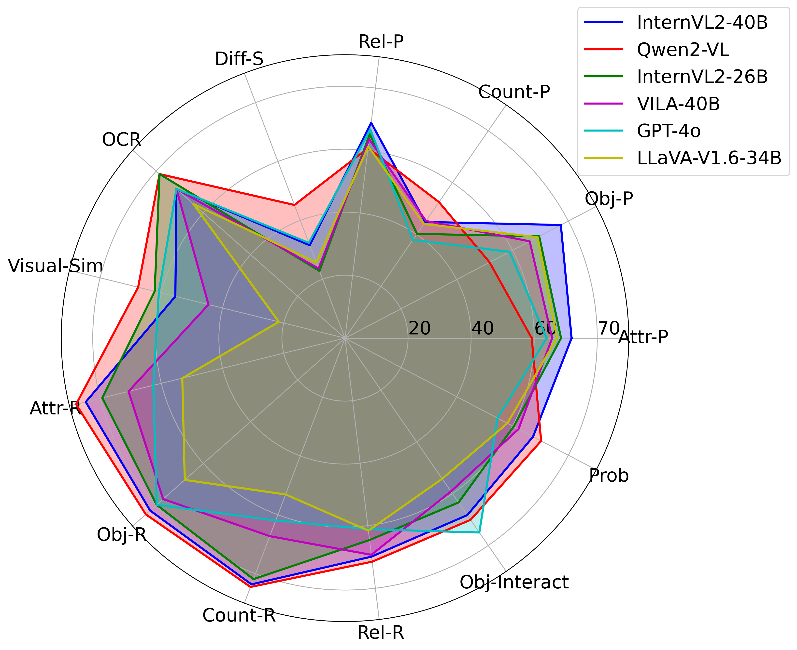
        

      

      
      
      
 
        <strong>Question Categorie Hierarchy</strong>: Question Types in MMComposition Benchmark for Evaluating Vision-Language Models.
      

    

  

</section>

<section class="section">
  

  
<h2 class="title is-3" id="exp">🧪 Experiments</h2>

  <!-- 幻灯箱1 开始 -->
   
  

    

      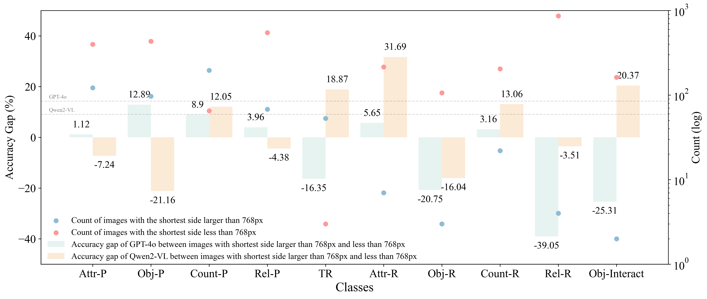
    

    

      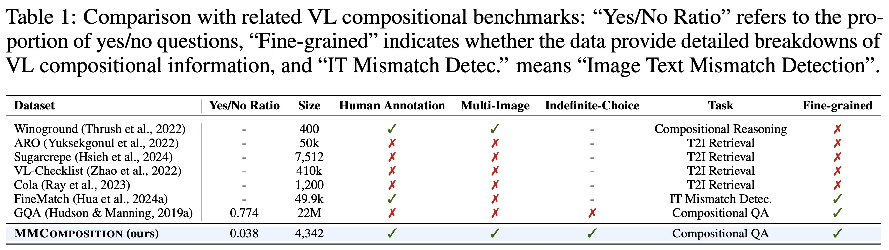
    

    

      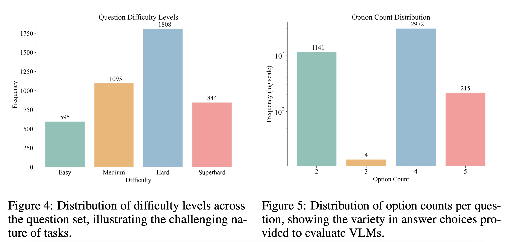
    

    

      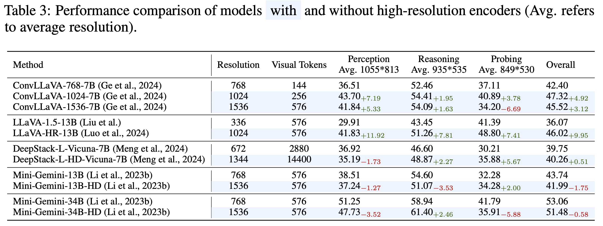
    

     

      
    

    

      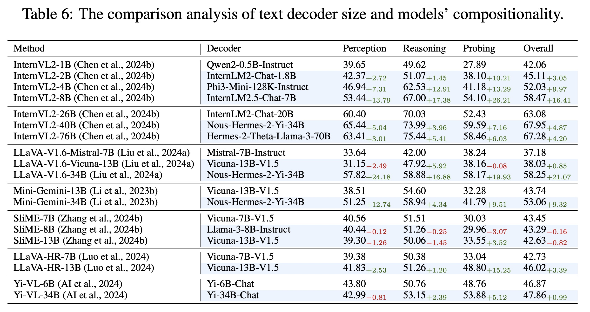
    

    <!-- 左右切换按钮 -->
    <a class="prev-1" onclick="plusSlides1(-1)">&#10094;</a>
    <a class="next-1" onclick="plusSlides1(1)">&#10095;</a>
  

   

  <!-- 小圆点导航1 -->
  

     
     
     
     
    
    
  

  <!-- 幻灯箱1 结束 -->

  

  

    

  <!-- 幻灯箱2 开始 -->
  
<h2 class="title is-3" id="vis">🔭 Visualization Results</h2>

   
  

    

      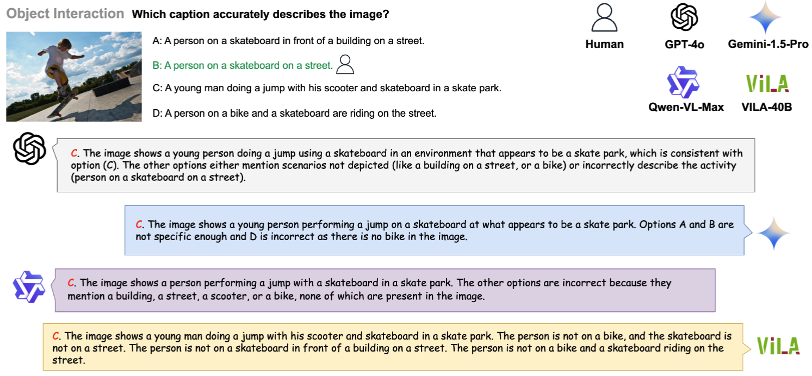
    

    

      
    

    

      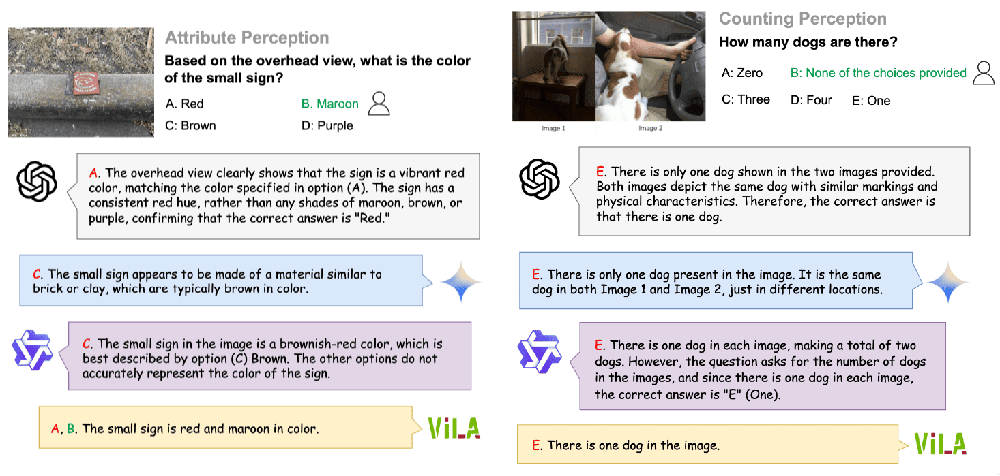
    

    

      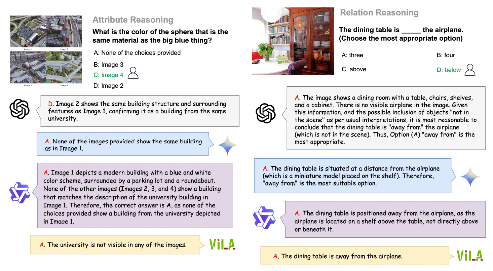
    

    

      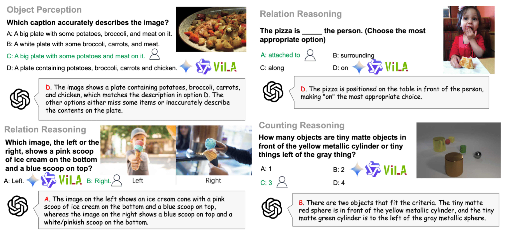
    

    

      
    

    <!-- 左右切换按钮 -->
    <a class="prev-2" onclick="plusSlides2(-1)">&#10094;</a>
    <a class="next-2" onclick="plusSlides2(1)">&#10095;</a>
  

   

  <!-- 小圆点导航2 -->
  

     
     
    
     
     
     
  

  <!-- 幻灯箱2 结束 -->

  

  

<section class="hero is-light is-small">
  

  <h1 class="title is-1 mathvista_other">
    Citation
  </h1>
  

</section>
<!-- </section> -->
<!-- <section class="hero is-light is-small">
  

    <h1 class="title is-1 mathvista_other" id="citation">Citation</h1>
  

</section> -->

<section class="section" id="BibTeX">
  

    <pre><code>
    @article{hua2024mmcomposition,
      title={MMComposition: Benchmarking the Compositionality for Pre-trained Vision-Language Models},
      author={Hua, Hang and Tang, Yunlong and Zeng, Ziyun and Cao, Liangliang and Yang, Zhengyuan and He, Hangfeng and Xu, Chenliang and Luo, Jiebo},
      journal={yunlong10.github.io},
      url={https://yunlong10.github.io/projects/mmcomposition/},
      year={2024}
    }
</code></pre>
  

</section>

<section class="section">
  

  

  

</section>

<footer class="footer">
  <!-- 
 -->
    

    

    

      

        

          

            This website is adapted from <a href="https://mathvista.github.io/">MathVista</a>, licensed under a <a rel="license"
                                                href="http://creativecommons.org/licenses/by-sa/4.0/">Creative
            Commons Attribution-ShareAlike 4.0 International License</a>.
          

        

      

    

  <!-- 
 -->
</footer>

</body>
</html>
